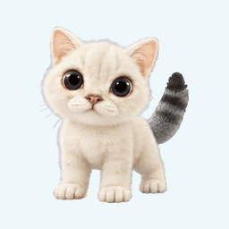
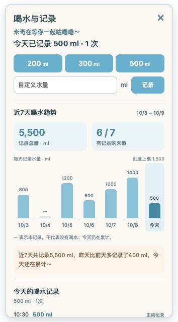

# 米奇 · 桌面上的小猫陪伴

[简体中文](README.md) · [English](README.en.md)

一只会撒娇、提醒你喝水的小猫，把日常互动和喝水记录留在你的电脑里，还能生成带着米奇的陪伴日记。

**[下载 macOS 版](https://github.com/Zimzheng/meowMickey/releases/download/v1.3.0/Mickey-macOS-arm64-v1.3.0.zip)** · **[下载 Windows 版](https://github.com/Zimzheng/meowMickey/releases/download/v1.3.0/Mickey-v1.3.0-windows-x86_64-setup.exe)** · [全部版本](https://github.com/Zimzheng/meowMickey/releases) · [反馈问题](https://github.com/Zimzheng/meowMickey/issues)

| 米奇陪着你 | 和米奇一起喝水 |
| :---: | :---: |
| [](https://github.com/Zimzheng/meowMickey/releases/tag/v1.3.0) | [](https://github.com/Zimzheng/meowMickey/releases/tag/v1.3.0) |

以上 GIF 使用应用内的实际动画素材和逐帧时长，浅蓝背景用于演示；安装后，米奇的窗口背景是透明的。点击动画进入下载页。

## 米奇能陪你做什么

- **让桌面多一点陪伴**：透明悬浮的小猫，可以拖到喜欢的位置。摸摸、双击、快速点击，会得到不同反应；还有打喷嚏、踩奶、歪头、伸懒腰和打哈欠。
- **把喝水变成一起做的小事**：米奇口渴时会提醒你。选择 200 / 300 / 500 ml 或输入自定义水量，米奇就会开心喝水，回应“咕噜噜～”。当天总量即时更新，误记可以撤销。
- **看见一周的小习惯**：在“喝水与记录”查看近7天水量趋势，点击日期查看时间、水量和记录来源；米奇会根据已保存的数据给出一句话总结。没有记录的日期显示“未记录”，今天仍在累计。
- **偶尔主动来找你**：久未互动时，米奇会说“米奇想你了，摸摸米奇吧～”。喝水提醒和定时动作支持夜间安静规则，提醒也可以稍后再处理。
- **分享一天的陪伴**：生成带米奇形象的日记图片，展示当天喝水总量、互动总数，以及摸摸、双击、喝水记录等具体明细。直接预览并复制图片或文字，方便粘贴给朋友。
- **按你的习惯调整**：右键调整大小、暂停定时动作、编辑提醒规则，或检查并安装新版。窗口位置和大小会保留到下次启动。

### 近7天喝水趋势

[](https://github.com/Zimzheng/meowMickey/releases/tag/v1.3.0)

上图使用虚构演示记录。统计窗口为本地日期的今天及此前6天，原有历史记录会继续使用；总结在本机生成。

## 下载与安装

当前发布版本：**v1.3.0**。直接下载安装包即可使用，无需安装 Rust 或 Node.js。

| 系统 | 下载 | 安装方式 |
| --- | --- | --- |
| macOS · Apple Silicon（M 系列） | [ZIP 安装包](https://github.com/Zimzheng/meowMickey/releases/download/v1.3.0/Mickey-macOS-arm64-v1.3.0.zip) | 解压，将 `米奇.app` 拖入“应用程序”，然后打开 |
| Windows 10 / 11 · x64 | [EXE 安装包](https://github.com/Zimzheng/meowMickey/releases/download/v1.3.0/Mickey-v1.3.0-windows-x86_64-setup.exe) | 运行中文安装向导，安装到当前用户目录；缺少 WebView2 时会下载运行环境 |

Intel Mac 和 Windows ARM 原生安装包暂未提供。macOS 当前包使用临时签名，尚未经过 Apple 公证；系统可能提示开发者未验证。安装相关问题请附上系统版本到 [Issues](https://github.com/Zimzheng/meowMickey/issues) 反馈。

安装包之外的 `.sig`、`.app.tar.gz` 和 `latest.json` 是应用内更新文件，日常安装请选择上表的 ZIP 或 EXE。

### 已经装过米奇？

右键米奇 → **更新米奇版本**。发现新版后，确认“更新并重启”，米奇会下载、验证更新签名、安装并重新启动。本地喝水和互动记录不随安装包发布，更新不会主动清除这些记录。

如果旧版还没有更新入口，先退出米奇，再手动安装。macOS 将新版 `米奇.app` 覆盖原应用即可。

## 开始和米奇相处

| 想做的事 | 操作 |
| --- | --- |
| 移动米奇 | 按住小猫拖动 |
| 摸摸 / 打喷嚏 | 默认单击踩奶、双击打喷嚏；可以在规则中修改 |
| 记录喝水 | 右键 → **喝水与记录** → 选择水量或输入 10–3000 ml |
| 查看七天趋势和某天明细 | 右键 → **喝水与记录**，点击图表中的日期 |
| 撤销误记 | 右键 → **撤销最近一次喝水**，或使用记录成功后的撤销按钮 |
| 分享陪伴日记 | 右键 → **米奇陪伴日记** → **复制图片** 或 **复制文字** |
| 调整大小 | 右键 → **大小**，选择 50%–200%；100% 为默认大小 |
| 暂停定时动作 | 右键 → **暂停／继续定时动作** |
| 找回隐藏的米奇 | 点击菜单栏 / 系统托盘中的爪印图标 |
| 退出 | 右键 → **退出米奇** |

喝水面板和日记预览在小猫旁边打开。分享时由你复制和粘贴，米奇不会自动发送内容给其他人。

## 记录与隐私

- **不需要账号**。当前实现将喝水数据写入本地应用数据目录，将互动记录存入本地 WebView 存储，没有云端同步功能。
- 喝水记录包含水量、日期、时间和来源，最多保留最近 **10,000 条**；互动记录最多保留最近 **500 条**。陪伴日记汇总当天仍保留的记录。
- **更新需要联网**：检查版本和下载安装包会访问 GitHub；Windows 首次安装可能需要下载 WebView2。
- 分享预览不会自动把图片保存到下载目录。请自行保管需要长期保存的日记和记录；清理应用数据或系统存储可能删除历史记录。

## 自定义提醒

右键 → **打开规则文件**，在现有 `rules.json` 中修改对应字段。保存后自动重载，也可以点 **重新加载规则**。

默认喝水提醒间隔为 60 分钟；夜间时段为 23:00–07:00。下面列出常用字段，可合并到现有配置中：

```json
{
  "hydrationEnabled": true,
  "hydrationEveryMinutes": 60,
  "sneezeEveryMinutes": 30,
  "kneadEveryMinutes": 5,
  "nightQuietEnabled": true,
  "nightStartHour": 23,
  "nightEndHour": 7,
  "singleClick": "kneading",
  "doubleClick": "sneezing"
}
```

完整字段见 [默认规则](rules.json)。优先使用应用旁边的规则文件；否则在用户应用数据目录创建可编辑的副本。喝水提醒是日常陪伴功能，记录水量由用户自行选择。

## 开发与贡献

米奇使用 **Tauri 2 + Rust + 原生 HTML / CSS / JavaScript**，前端无需 npm 构建。

安装稳定版 Rust、Tauri CLI 2.11.4，以及对应系统的编译工具后：

```bash
git clone https://github.com/Zimzheng/meowMickey.git
cd meowMickey
cargo install tauri-cli --version 2.11.4 --locked
cargo tauri dev
```

开发环境、macOS / Windows 打包命令和验证方式见 [开发指南](docs/DEVELOPMENT.md)。本次功能和验证见 [1.3.0 发布说明](docs/RELEASE_1.3.0.md)。正式发布的签名与双平台清单见 [版本更新说明](docs/UPDATES.md)。

| 目录 | 作用 |
| --- | --- |
| `src-tauri/src/` | 窗口、托盘、规则调度、本地饮水存储、系统剪贴板和版本更新 |
| `ui/` | 动画、互动、喝水面板与日记绘制 |
| `ui/sprites/` | 米奇动画素材 |
| `rules.json` | 默认互动与提醒配置 |
| `.github/workflows/` | Windows 自动测试、构建和安装包发布 |

欢迎在 [Issues](https://github.com/Zimzheng/meowMickey/issues) 提交问题或建议。反馈问题时请说明系统、米奇版本、复现步骤，并提供经过隐私检查的截图。

目前仓库未提供 LICENSE 文件；如需再分发代码或米奇素材，请先联系作者确认授权。
